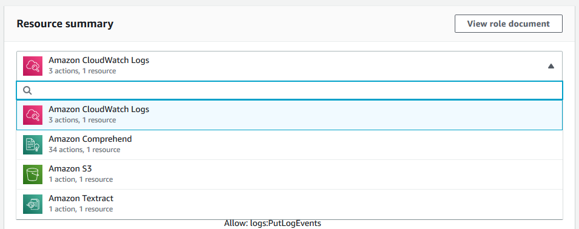

[Workshop](../../README.md) | [Lab 0](../../Lab0/README.md) | [Lab 1](../Lab1/README.md)

# LAB 2 - Synchronous - Extract entities with Comprehend

[Amazon Comprehend](https://docs.aws.amazon.com/comprehend/latest/dg/what-is.html) is a service that uses natural language processing (NLP) to extract insights about the content of documents. Comprehend takes text (UTF-8) as input and recognize entities, key phrases, language and sentiments.

In this lab, we will use the text previously extracted with Textract and apply Comprehend on it, in order to retrieve entities.

<a name="archi_sync"></a>

## Architecture


[See steps 1-5 from Lab 1](../Lab1/README.md#archi_sync)

In step 6, we call the ``DetectEntities`` API from Comprehend in the Lambda function we created (*documentTextract-xyz*). 
  
## Comprehend in the lambda function

### Add permissions to the function
The function needs persmissions to invoke Comprehend. Let's update the role automatically created during the function creation. Click on the *documentTextract-xyz* function, then scroll down to the **Execution Role** and click **View the textract-index-stack-LambdaExecutionRole-xyz**:


In the new window, click on **Attach policies**, search for *ComprehendReadOnly*, check it and click **Attach policy**:


Back to the lambda function screen, refresh the page, you should now see Amazon Comprehend in the **Permissions** tab. Our lambda function is now able to call Comprehend APIs:



### Update the lambda code to call Comprehend

In the source code of your lambda function (index.py), add the following line after `import boto3`:

```python
comprehend = boto3.client('comprehend')
```

And the following at the end of the handler function:

```python
	text = page[:5000]
	
	languages = comprehend.detect_dominant_language(
		Text=text
	)
	dominant_language = sorted(languages['Languages'], key=lambda k: k['LanguageCode'])[0]['LanguageCode']
	if dominant_language not in ['en','es','fr','de','it','pt']:
		# optional: call Amazon translate to get it in english
		# https://boto3.amazonaws.com/v1/documentation/api/latest/reference/services/translate.html#Translate.Client.translate_text
		dominant_language = "en"
		
	detected_entities = comprehend.detect_entities(
	    Text=text,
	    LanguageCode=dominant_language
	)
	selected_entity_types = ["ORGANIZATION", "PERSON", "LOCATION", "DATE"]
	selected_entities = [x for x in detected_entities['Entities'] if x['Score'] > 0.9 and x['Type'] in selected_entity_types]
	
	print(selected_entities)
```

Click **Save**. Few information to notice here:

- Before calling the ``DetectEntities`` API, we need to be aware of few [limits](https://docs.aws.amazon.com/comprehend/latest/dg/API_DetectEntities.html#API_DetectEntities_RequestParameters) of the service: 

  - First, the text must contain less that 5000 bytes (UTF-8 encoded characters). That's why we cut the text to 5000 on the first line.
  - Second, the text must be in a [supported language](https://docs.aws.amazon.com/comprehend/latest/dg/supported-languages.html), for example German ("de"), English ("en") or Spanish ("es"). Comprehend provides [an API to detect the language of a document](https://docs.aws.amazon.com/comprehend/latest/dg/API_DetectDominantLanguage.html). We could associate this with another service, Amazon Translate, to get the translation of the text in the desired language, if not already.

- We then call the [``DetectEntities``](https://docs.aws.amazon.com/comprehend/latest/dg/API_DetectEntities.html) API to retrieve entities in the document. The API will return a list of [Entity](https://docs.aws.amazon.com/comprehend/latest/dg/API_Entity.html): the text, their position (offsets), a score for the level of confidence, and a type (PERSON, LOCATION, ORGANIZATION, DATE, ...). In our code, we select only a subset of all types and only the entities with a score higher than 0.9 over 1. You can test without that filter if you want to see everything that is returned by Comprehend.

### Test
Proceed as in the previous lab. Upload a document to the *workshop-textract-xyz* S3 bucket and open the [Cloudwatch logs](https://console.aws.amazon.com/cloudwatch/home#logs:prefix=/aws/lambda/documentTextract). Observe the result:

```
[{'Score': 0.9834662079811096, 'Type': 'PERSON', 'Text': 'Neil A. Armstrong', 'BeginOffset': 140, 'EndOffset': 156},{'Score': 0.9590600728988647, 'Type': 'LOCATION', 'Text': 'Houston, Texas', 'BeginOffset': 4530, 'EndOffset': 4544}, ...]
```

# LAB 3
In Lab 3, we will index both the content text and the entities in Elasticsearch.

[Goto to Lab 3 >>>](../Lab3/README.md)
